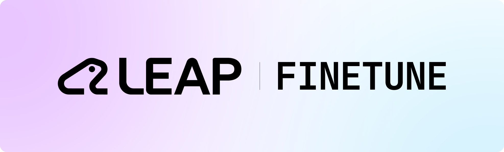

<div align="center">
  
  <div style="display: flex; justify-content: center; gap: 0.5em;">
    <a href="https://playground.liquid.ai/"><strong>Try LFM</strong></a> •
    <a href="https://docs.liquid.ai/lfm"><strong>Documentation</strong></a> •
    <a href="https://leap.liquid.ai/"><strong>LEAP</strong></a>
  </div>
  <br/>
  <a href="https://discord.com/invite/liquid-ai"></a>
</div>
</br>

A minimal fine-tuning repo for LFM2, fully built on Open Source.

We support different acceleration backends, including GPU nodes of 8xH100 80GB (both single node and multi node) as well as Modal (H100, H200, B200, ..) in case you don't have your own GPUs.

For feature requests or if you have a different setup, reach out to [support@liquid.ai](mailto:support@liquid.ai) and tell us about your specific configuration.

## 🔧 Setup

### 1. Install uv

```bash
curl -LsSf https://astral.sh/uv/install.sh | sh
```

### 2. Clone Repo

```bash
git clone <repository-url>
cd leap_finetune
```

### 3. Set up virtual environment

For CUDA / NVIDIA clusters, CUDA dependencies are included by default:

```bash
uv sync
```

For AMD / ROCm clusters, install the ROCm dependency group instead of the default CUDA group:

```bash
uv sync --no-group cuda --group rocm
```

The ROCm group is lockfile-managed and uses vLLM's ROCm wheel index for vLLM plus
its matching `torch`, `torchvision`, `torchaudio`, `flash-attn`, and `triton`
stack. The currently pinned vLLM ROCm wheels are Python 3.12 Linux wheels, so use
the repo's `.python-version` when creating AMD environments.

## 🚀 Quickstart

### 1. Job Configuration Setup

Create a YAML config file (or copy one from [`job_configs/`](./job_configs/)):

```yaml
project_name: "my_sft_project"
model_name: "LFM2-1.2B"
training_type: "sft"

dataset:
  path: "HuggingFaceTB/smoltalk"
  type: "sft"
  limit: 1000
  test_size: 0.2
  subset: "all"

training_config:
  extends: "DEFAULT_SFT"
  num_train_epochs: 3
  per_device_train_batch_size: 2
  learning_rate: 2e-5

peft_config:
  extends: "DEFAULT_LORA"
  use_peft: true
```

- `training_config.extends` inherits from a base config (e.g. `DEFAULT_SFT`, `DEFAULT_DPO`, `DEFAULT_VLM_SFT`) — any fields you specify override the base
- `peft_config.extends` works the same way (e.g. `DEFAULT_LORA`, `DEFAULT_VLM_LORA`)
- See [`job_configs/`](./job_configs/) for more examples (DPO, MoE, VLM, SLURM)

### 2. Launch Training

Run locally:

```bash
uv run leap-finetune <path_to_config.yaml>
```

It uses Ray Train + Accelerate for distributed training.

Unless you overwrote `output_dir`, results will be stored in `outputs/{project_name}/{run_name}/`. Each run gets its own directory with a unique name based on model, dataset, LR, and timestamp.

### Modal Support

You can run training jobs on Modal's serverless GPUs directly from your Mac or laptop — no local GPU required.

**One-time setup:**

```bash
huggingface-cli login   # required — used for model downloads and trackio
modal setup              # configure Modal credentials
```

**Add a `modal:` section to any config:**

```yaml
modal:
  gpu: "H100:4"
  timeout: 86400
  output_volume: "leap-finetune"
  output_dir: "/outputs"
  detach: false
```

**Run:**

```bash
uv run leap-finetune job_configs/sft_example_modal.yaml
```

That's it. The CLI will:

1. Build the container image (~5 min on first run, cached after that)
2. Auto-create a `huggingface-secret` on Modal from your local HF token
3. Stream build and training logs to your terminal in real-time
4. Save checkpoints to a Modal Volume

**Retrieving checkpoints:**

```bash
modal volume ls leap-finetune                                        # list saved checkpoints
modal volume get leap-finetune <checkpoint-name> ./local-outputs     # download to local
```

**Detached mode:** Set `detach: true` in the modal config to submit and disconnect. Monitor with `modal app logs leap-finetune`.

See [`job_configs/sft_example_modal.yaml`](./job_configs/sft_example_modal.yaml) for all available options.

### SLURM Support

If your config includes a `slurm` section, running `leap-finetune` will auto-generate and submit a SLURM script. You can also generate SLURM scripts without submitting:

```bash
uv run leap-finetune slurm <path_to_config.yaml>
```

To monitor your SLURM jobs in a TUI:

```bash
uv run turm --me
```

### 3. (Optional) Experiment Tracking

Add `tracker` to your `training_config`:

```yaml
training_config:
  tracker: "trackio" # or "wandb"
```

#### Trackio

[Trackio](https://huggingface.co/blog/trackio) is a free experiment tracker that logs to a HuggingFace Space.

```yaml
training_config:
  tracker: "trackio"
  trackio_space_id: "username/my-dashboard" # auto-created if it doesn't exist
```

Requires a HF token (via `huggingface-cli login`). On Modal, the token is auto-injected — no extra setup needed. View your dashboard at `https://huggingface.co/spaces/<trackio_space_id>`.

#### Weights & Biases

[Weights & Biases](https://wandb.ai) is a popular experiment tracking platform.

```yaml
training_config:
  tracker: "wandb"
```

Set your API key locally with `export WANDB_API_KEY=your_key`. On Modal, add a secret:

```bash
modal secret create wandb-secret WANDB_API_KEY=your_key
```

Then add it to your Modal config:

```yaml
modal:
  secrets:
    - "wandb-secret"
```

### 4. Bundle Checkpoint for LEAP

When training is done, you can bundle your output checkpoint with `leap-bundle` to use it directly within LEAP. Checkout our [Quick Start guide](https://leap.liquid.ai/docs/leap-bundle/quick-start?utm_source=github&utm_medium=link&utm_campaign=LEAP&utm_content=general).

## 📊 Expected Dataset Formats

### SFT (Supervised Fine-Tuning)

```json
{
  "messages": [
    { "role": "user", "content": "What is the capital of France?" },
    { "role": "assistant", "content": "The capital of France is Paris." }
  ]
}
```

### DPO (Direct Preference Optimization)

```json
{
  "prompt": "What is the capital of France?",
  "chosen": "The capital of France is Paris.",
  "rejected": "The capital of France is London."
}
```

### VLM SFT (Vision-Language Model)

```json
{
  "messages": [
    {
      "role": "system",
      "content": [
        {
          "type": "text",
          "text": "You are an image-based assistant. Answer questions based on the provided image."
        }
      ]
    },
    {
      "role": "user",
      "content": [
        { "type": "image", "image": "/path/to/image.jpg" },
        { "type": "text", "text": "What do you see in this image?" }
      ]
    },
    {
      "role": "assistant",
      "content": [{ "type": "text", "text": "I see a car in the image." }]
    }
  ]
}
```

> **Note**: VLM datasets commonly have images in a separate row and are referenced in the messages column. If your image URLs or Paths are in a separate column from your messages, you'll need to merge the images into the 'messages' section like above.

### GRPO (Group Relative Policy Optimization)

GRPO trains with RL rewards on top of TRL v1's `GRPOTrainer`, wrapped
with vLLM rollouts and a plain-Python rewards directory. Same single
YAML workflow as SFT/DPO. Supports both text (`training_type: "grpo"`)
and VLM (`training_type: "vlm_grpo"`); the VLM trainer applies the same
per-component learning rates as VLM SFT so RL updates don't corrupt
pretrained vision features.

GRPO datasets reuse the SFT `messages` format — the loader auto-splits
each row into `prompt` (non-assistant turns) and `solution` (last
assistant text), so one parquet drives both SFT warm-up and GRPO with
no reshaping. Any extra columns are forwarded to rewards as kwargs.

**Rewards.** Composed from a single YAML block pointing at Python files
in [`rewards/`](./rewards/README.md) — either individual primitives
(`accuracy.py`, `length.py`, ...) or a whole task recipe
(`rewards/tasks/<task>/recipe.py::<Recipe>`). Shipped recipes cover VLM
grounding (IoU-F1 and CIoU-F1), GSM8K, MCQA, and IFEval. Adding a reward
is a plain Python function; extending a shipped recipe is regular
subclassing. See [`rewards/README.md`](./rewards/README.md) for the API
contract and the extension pattern.

**vLLM rollouts.** Two modes, both driven from YAML:

- **Colocate** (default) — vLLM runs inside each training worker and
  shares GPU memory. Works on single node and **scales to multi-node**
  out of the box.
- **Server** — `trl vllm-serve` runs on a dedicated GPU and training
  workers reach it over HTTP. Currently **single-node only**; multi-node
  support is tracked and will land in a follow-up.

**Example configs** — copy and edit instead of writing YAML from scratch:

- [`job_configs/grpo_example.yaml`](./job_configs/grpo_example.yaml) —
  text GRPO quickstart, single node, GSM8K recipe.
- [`job_configs/vlm_grpo_grounding_example.yaml`](./job_configs/vlm_grpo_grounding_example.yaml)
  — VLM GRPO with the visual-grounding recipe, 2-node colocate demo.

Launch the same way as SFT/DPO:

```bash
uv run leap-finetune job_configs/grpo_example.yaml
```

**Agentic environments (advanced).** For tasks where the environment
state evolves from agent actions (browsing, tool use, game simulators,
stateful multi-turn), `leap-finetune` also supports
[OpenEnv](https://github.com/meta-pytorch/OpenEnv) via an optional
`rl_env:` block. Install with `uv sync --extra rl-env` and see
[`src/leap_finetune/rl_envs/README.md`](./src/leap_finetune/rl_envs/README.md).
For anything scorable by a pure Python function, prefer the `rewards:`
path above — it is simpler and faster.

## 🔄 Resuming Training

If a run is interrupted (SLURM preemption, crash, etc.), you can resume from the last checkpoint with full optimizer state, LR schedule, and wandb continuity.

Add `resume_from_checkpoint` to your `training_config`:

```yaml
training_config:
  resume_from_checkpoint: "latest" # resumes from the most recent checkpoint
```

This finds the most recent run directory under `outputs/{project_name}/` and resumes from its latest checkpoint. To resume from a specific checkpoint instead:

```yaml
training_config:
  resume_from_checkpoint: "/path/to/outputs/my_project/run_name/checkpoint-step-8000"
```

**What gets restored:** model weights, optimizer states, LR scheduler position, training step counter, and RNG states.

**Wandb continuity:** The wandb run ID is saved to `<run_dir>/.wandb_run_id` automatically. On resume, it restores the same wandb run. Fresh runs always get a new wandb run.

## 📈 Evaluation Benchmarks

Run benchmarks automatically during training at every `eval_steps`. Add a `benchmarks` section to your YAML config:

```yaml
benchmarks:
  max_new_tokens: 128
  benchmarks:
    - name: "mmmu_val"
      path: "/data/mmmu_val.jsonl"
      metric: "short_answer"

    - name: "imagenette"
      path: "/data/imagenette_eval.jsonl"
      metric: "logprob_zero_shot"
```

Benchmark data uses the **same format as training data** (HF messages schema). Available metrics: `short_answer`, `grounding_iou`, `mcq_gen`, `logprob_zero_shot`. Results are logged to wandb at `benchmark/{name}/score`.

See the [Evaluation Guide](./src/leap_finetune/evaluation/README.md) for data format examples, YAML reference, and how to add custom metrics.

### Post-Training Evaluation with lmms-eval

For comprehensive post-training evaluation on standard VLM benchmarks (MMMU, OCRBench, RefCOCO, POPE, etc.), install the optional `lmms-eval` extra:

```bash
uv sync --extra lmms-eval
```

This installs [lmms-eval](https://github.com/Liquid4All/lmms-eval) with built-in LFM2-VL model support.

**Evaluate a fine-tuned checkpoint:**

```bash
# Single GPU
python -m lmms_eval \
    --model lfm2_vl \
    --model_args pretrained=/path/to/checkpoint \
    --tasks mmmu_val,ocrbench,pope \
    --batch_size 1

# Multi-GPU
torchrun --nproc-per-node=4 -m lmms_eval \
    --model lfm2_vl \
    --model_args pretrained=/path/to/checkpoint \
    --tasks mmmu_val,ocrbench,pope \
    --batch_size 1
```

**For faster evaluation with vLLM backend (~8x speedup):**

```bash
uv sync --extra lmms-eval-vllm

python -m lmms_eval \
    --model lfm2_vl_vllm \
    --model_args pretrained=/path/to/checkpoint,tensor_parallel_size=1,gpu_memory_utilization=0.85 \
    --tasks mmmu_val,ocrbench,pope \
    --batch_size 64
```

**Updating lmms-eval to latest:**

```bash
uv lock --upgrade-package lmms-eval
uv sync --extra lmms-eval
```

> **Note:** Requires SSH access to the Liquid4All GitHub repos. The lmms-eval and vllm packages are sourced from private Liquid4All forks with LFM2 model support.

## 🧪 Advanced Configuration

Default base configs live in [`src/leap_finetune/training_configs/`](./src/leap_finetune/training_configs/) and are auto-discovered — new configs added to these files are immediately available via `extends` in YAML.

[Liger Kernel](https://github.com/linkedin/Liger-Kernel) is pre-installed. Enable it with `use_liger_kernel: true` in your `training_config`.

## 📂 Dataset Loading

The `dataset.path` field in your YAML config accepts local files, HuggingFace Hub IDs, and cloud storage URIs:

| Source          | Example `path`                                 |
| --------------- | ---------------------------------------------- |
| Local file      | `/path/to/data.jsonl`, `/path/to/data.parquet` |
| HuggingFace Hub | `HuggingFaceTB/smoltalk`                       |
| S3              | `s3://bucket/path/to/data.parquet`             |
| GCS             | `gs://bucket/path/to/data.parquet`             |
| Azure           | `az://container/path/to/data.parquet`          |

Cloud storage requires appropriate credentials (AWS, GCP, or Azure). Use `subset` for HuggingFace datasets with multiple configs, and `limit` to cap the number of samples for quick testing.

## Contributing

1. Hook `pre-commit` to git: `uv run pre-commit install`
2. Open a PR with your changes

Pre-commit will now run automatically on commits, or run manually:

```bash
uv run pre-commit run --all-files
```

Please include a thorough description of changes and additions in your PR.
